# Module-2 Assignment Checklist (Catur Ageng P)

My Website : https://agengdev.my.id/

## Week 3

- [x] Responsive Image

  - [x] implement contain or cover
  - [x] implement image srcset

- [x] Responsive asymmetrical layout
- [x] Implement date input
- [x] Font customization

  - [x] using @font-face
  - [x] using text-shadow
  - [x] using list-style

- [x] Responsive animation and transition

  - [x] using @keyframes
  - [x] using transition
  - [x] responsive

## Week 4

- [x] Documenting deployment
- [x] Connect Netlify to Github
- [x] Using custom domain

## Advanced

- [x] 90 rating on Google Lighthouse
- [ ] Light-Dark Mode
- [ ] Carousel without JS

## Documentation of Deployment

### 1. Netlify Sign up process & connect Netlify to your Github project

- First you have to sign up for Netlify (here I signed up using email).
  [Sign Up]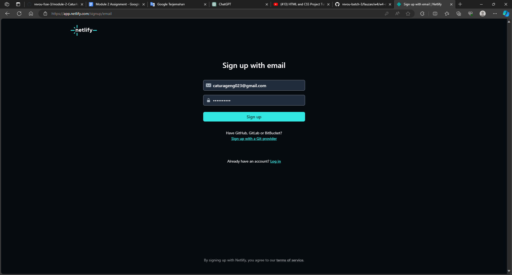

- After you have successfully logged in, the next step is to connect Netlify with your Github account.

- On the left side of the display there are several menus, click on the deploys menu, then in the Repository section click on the 'Manage Repository' menu.
  [Deploy]

- After that, you have to select the 'Deploy with Github' section so that your Github account can be connected to Netlify.

- Then select Repository on the Github account that you will connect to Netlify.
  [Memilih repository]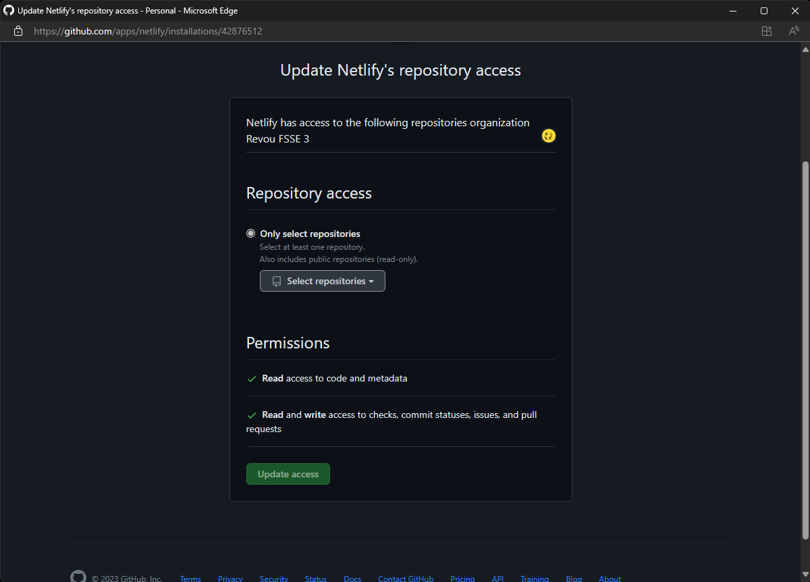

-And configure your Repository on Netlify.
[Konfigurasi Repository]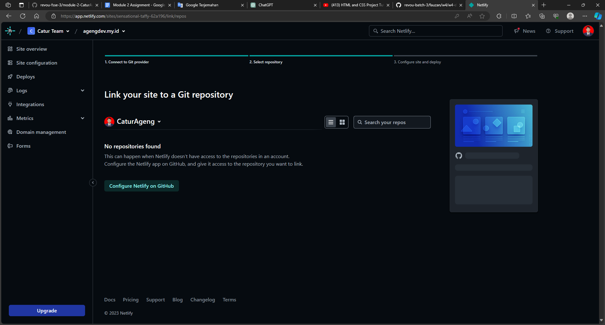

- Your Github account is already connected to Netlify.
  [Sudah terhubung]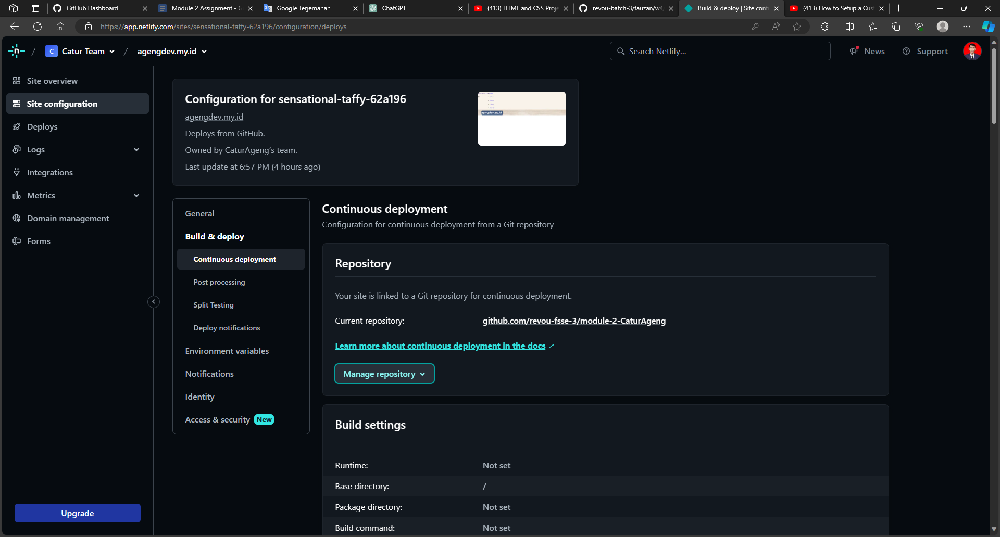.

### 2. How to connect your custom domain and DNS

- The first thing you have to do is click on the 'Domain Management' menu.
  [Pertama]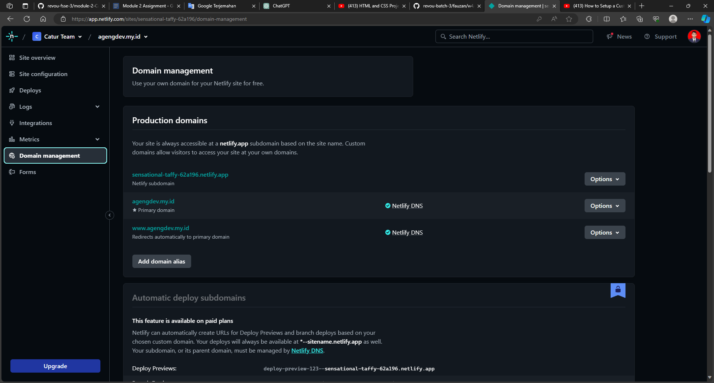

- Next, select the 'Add domain' menu.
  [Kedua]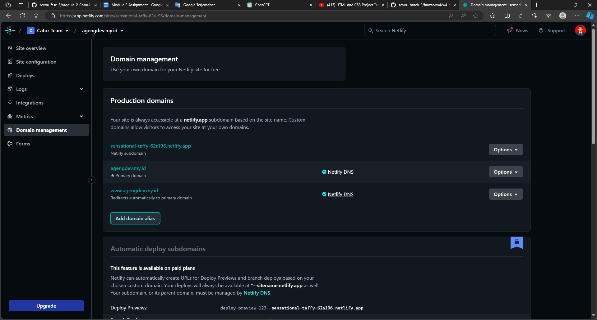

- Enter the domain name that you already own.
  [Ketiga]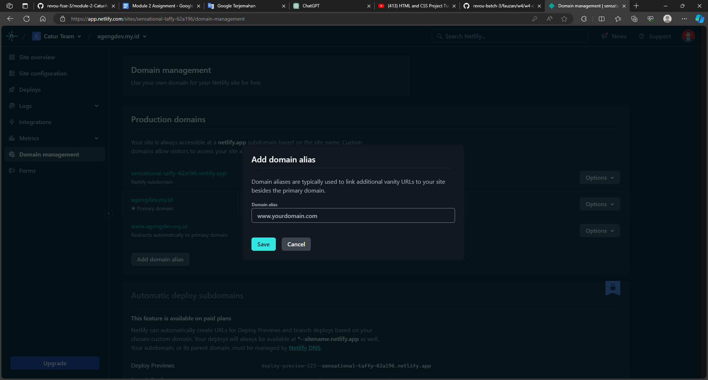

- Click on the DNS section.
  [Keempat]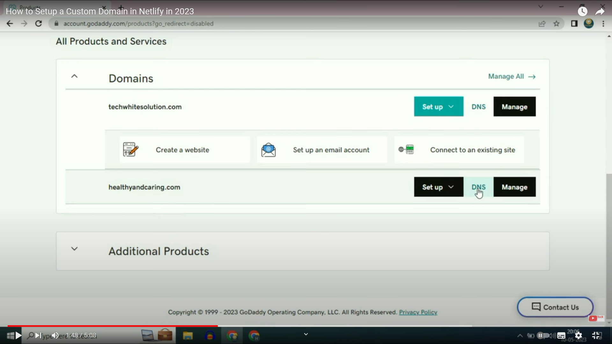

- Go to the Nameservers section, then click Change and enter the Nameservers you got at the beginning.
  [Kelima]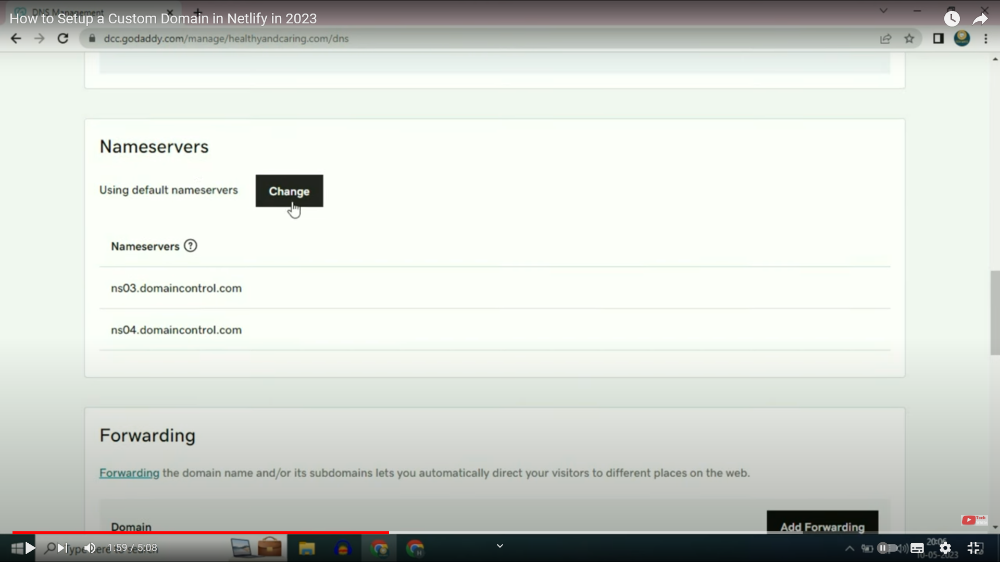
  [Keenam]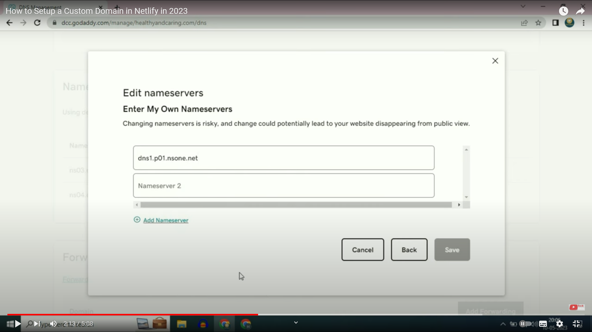
  [Ketujuh]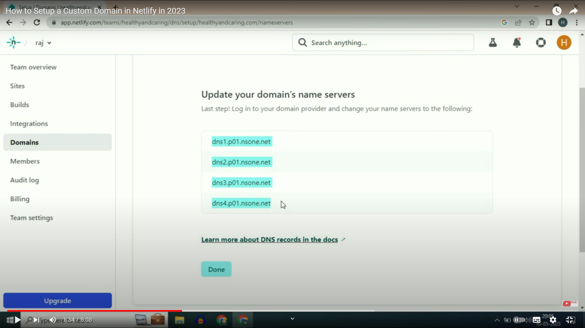

- After all the steps have been carried out, then look at the 'Domain management' menu. Make sure Netlify DNS is checked.
  [Pengecekan]
